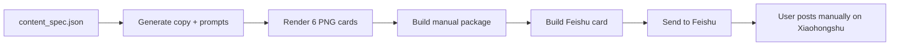

# xhs-feishu-delivery

Codex skill for generating a Xiaohongshu image-text package and sending the complete package to Feishu for manual posting.

It does **not** automate Xiaohongshu publishing, login, cookies, MCP, or browser control.

## Workflow



## Install Skill

```powershell
git clone https://github.com/nulideurijah-creator/xhs-feishu-delivery.git
Copy-Item -Recurse -Force .\xhs-feishu-delivery "$env:USERPROFILE\.codex\skills\xhs-feishu-delivery"
```

Restart Codex after installing.

## Create Workspace

```powershell
python "$env:USERPROFILE\.codex\skills\xhs-feishu-delivery\scripts\run_xhs_delivery.py" --workspace "D:\path\to\xhs-workspace" --init-workspace
cd "D:\path\to\xhs-workspace"
python -m pip install -r requirements.txt
```

Configure Feishu credentials:

```powershell
Copy-Item .\feishu-delivery\.env.example .\feishu-delivery\.env
notepad .\feishu-delivery\.env
```

Required variables:

```text
FEISHU_APP_ID=
FEISHU_APP_SECRET=
FEISHU_RECEIVE_ID_TYPE=open_id
FEISHU_RECEIVE_ID=
```

## Run

Validate without Feishu:

```powershell
python "$env:USERPROFILE\.codex\skills\xhs-feishu-delivery\scripts\run_xhs_delivery.py" --workspace "D:\path\to\xhs-workspace" --local-only
```

Check Feishu credentials:

```powershell
python "$env:USERPROFILE\.codex\skills\xhs-feishu-delivery\scripts\run_xhs_delivery.py" --workspace "D:\path\to\xhs-workspace" --check-feishu
```

Send the complete package to Feishu:

```powershell
python "$env:USERPROFILE\.codex\skills\xhs-feishu-delivery\scripts\run_xhs_delivery.py" --workspace "D:\path\to\xhs-workspace" --send
```

## Startup Check

After Windows logon:

```powershell
python "$env:USERPROFILE\.codex\skills\xhs-feishu-delivery\scripts\run_xhs_delivery.py" --workspace "D:\path\to\xhs-workspace" --install-startup-check
```

Before any user logs in, run from an administrator shell:

```powershell
python "$env:USERPROFILE\.codex\skills\xhs-feishu-delivery\scripts\run_xhs_delivery.py" --workspace "D:\path\to\xhs-workspace" --install-system-startup-check
```

## Safety

- Manual Xiaohongshu posting only.
- No Xiaohongshu MCP.
- No Xiaohongshu cookies.
- No browser publishing automation.
- No Feishu buttons, callbacks, WebSocket receiver, or tunnel.
- Workspace runs are protected by `.xhs_delivery.lock`.

## Validate Skill

```powershell
python scripts\validate_skill_safety.py --skill-dir .
python -m py_compile scripts\run_xhs_delivery.py scripts\init_workspace.py scripts\validate_skill_safety.py
```

## License

MIT
