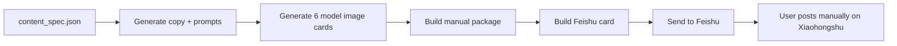

# xhs-feishu-delivery

`xhs-feishu-delivery` is a Codex skill plus a ready-to-copy workspace template for producing Xiaohongshu image-text posts and delivering the complete posting package to Feishu.

The project is designed for creators who want an AI-assisted content production workflow but still want to post manually on Xiaohongshu. It generates copy and image prompts, uses mature image-generation skills/models for the 6 final image cards, builds a manual publishing package, and sends the full title/body/tags/images to Feishu so the user can publish from mobile.

It does **not** automate Xiaohongshu publishing, login, cookies, MCP, or browser control.

## What You Get

- A Codex skill entrypoint: `SKILL.md`.
- A complete workspace template under `assets/workspace-template`.
- A wrapper for initializing, validating, packaging, and sending.
- A model-first image step: final image cards should come from `baoyu-image-cards`/Codex `imagegen`, using the bundled `xhs-ai-hook-sketch` style for stronger Xiaohongshu cover hooks.
- Feishu health checks that can run after Windows logon.
- Safety checks that prevent accidental Xiaohongshu automation or secret leakage.

## Workflow



## Repository Guide

Every file in this repository is explained in [PROJECT_GUIDE.md](PROJECT_GUIDE.md).

The image-generation handoff is documented in [references/image_generation.md](references/image_generation.md).

## Install Skill

```powershell
git clone https://github.com/nulideurijah-creator/xhs-feishu-delivery.git
Copy-Item -Recurse -Force .\xhs-feishu-delivery "$env:USERPROFILE\.codex\skills\xhs-feishu-delivery"
```

Restart Codex after installing.

## Create Workspace

```powershell
python "$env:USERPROFILE\.codex\skills\xhs-feishu-delivery\scripts\run_xhs_delivery.py" --workspace "D:\path\to\xhs-workspace" --init-workspace
cd "D:\path\to\xhs-workspace"
python -m pip install -r requirements.txt
```

Configure Feishu credentials:

```powershell
Copy-Item .\feishu-delivery\.env.example .\feishu-delivery\.env
notepad .\feishu-delivery\.env
```

Required variables:

```text
FEISHU_APP_ID=
FEISHU_APP_SECRET=
FEISHU_RECEIVE_ID_TYPE=open_id
FEISHU_RECEIVE_ID=
```

## Run

Validate without Feishu:

```powershell
# First create copy and image prompts:
python .\asset-generation\generate_current_assets.py

# Then generate the 6 PNG cards with baoyu-image-cards / Codex imagegen and
# save them to the image_path values in asset-generation\outputs\current-publish-assets.json.
# The bundled .baoyu-skills config prefers xhs-ai-hook-sketch: no watermark,
# warm hand-drawn AI cards, and a stronger first-card hook.
# If you use another image model, keep the same output paths.

# Finally package and validate:
python "$env:USERPROFILE\.codex\skills\xhs-feishu-delivery\scripts\run_xhs_delivery.py" --workspace "D:\path\to\xhs-workspace" --local-only
```

Check Feishu credentials:

```powershell
python "$env:USERPROFILE\.codex\skills\xhs-feishu-delivery\scripts\run_xhs_delivery.py" --workspace "D:\path\to\xhs-workspace" --check-feishu
```

Send the complete package to Feishu:

```powershell
python "$env:USERPROFILE\.codex\skills\xhs-feishu-delivery\scripts\run_xhs_delivery.py" --workspace "D:\path\to\xhs-workspace" --send
```

## Startup Check

Recommended long-term desktop setup: run the Feishu health check after Windows logon. This is the most reliable mode for normal creator workstations because it uses the same user account, Python install, workspace path, and network profile as the manual workflow.

```powershell
python "$env:USERPROFILE\.codex\skills\xhs-feishu-delivery\scripts\run_xhs_delivery.py" --workspace "D:\path\to\xhs-workspace" --install-startup-check
```

Machine-startup before any user logs in is possible only when Windows allows a SYSTEM scheduled task to access the workspace and Python install. Use this only for unattended-server style setups:

```powershell
python "$env:USERPROFILE\.codex\skills\xhs-feishu-delivery\scripts\run_xhs_delivery.py" --workspace "D:\path\to\xhs-workspace" --install-system-startup-check
```

## Safety

- Manual Xiaohongshu posting only.
- No Xiaohongshu MCP.
- No Xiaohongshu cookies.
- No browser publishing automation.
- No local template drawing renderer for final cards.
- No Feishu buttons, callbacks, WebSocket receiver, or tunnel.
- Workspace runs are protected by `.xhs_delivery.lock`.

## Validate Skill

```powershell
python scripts\validate_skill_safety.py --skill-dir .
python -m py_compile scripts\run_xhs_delivery.py scripts\init_workspace.py scripts\validate_skill_safety.py
```

## License

MIT
